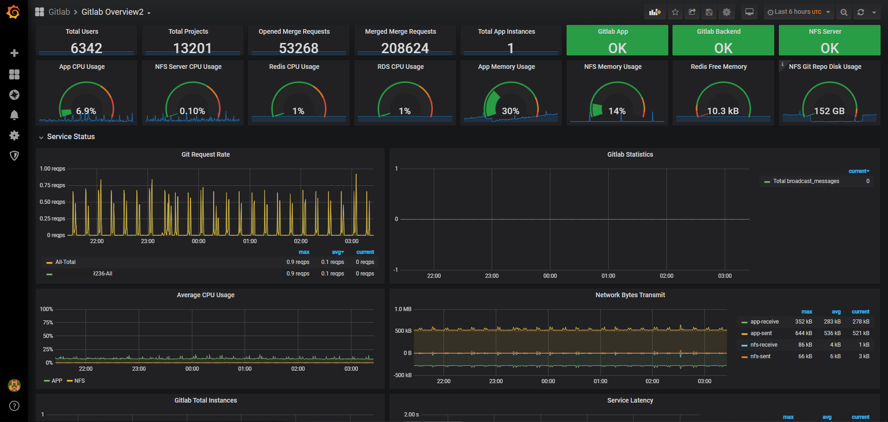
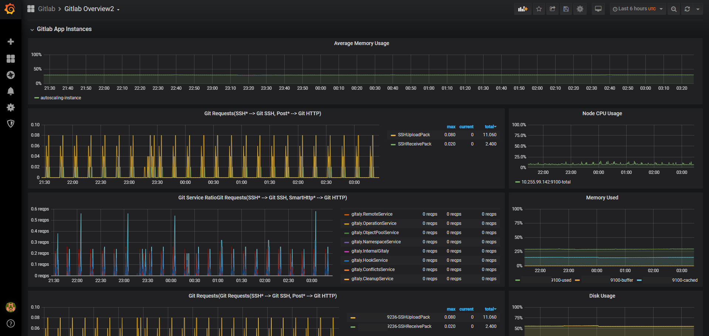
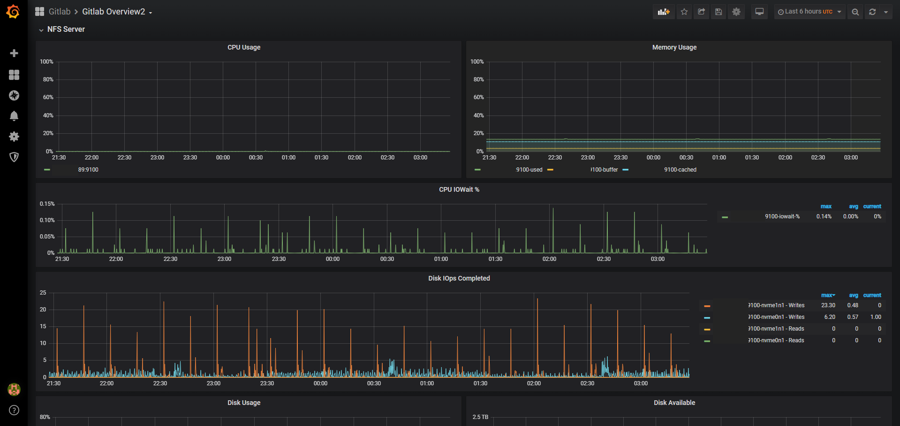
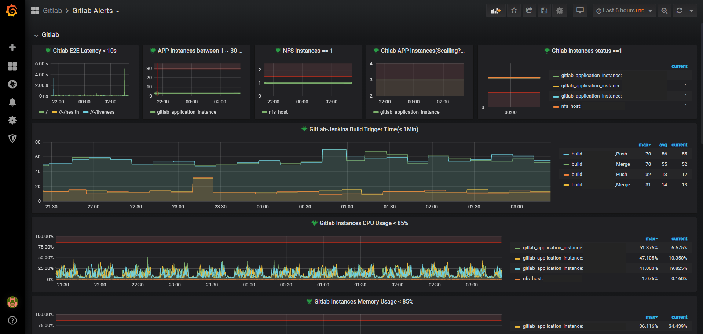

# gitlab-grafana-dashboard
Grafana dashboard for Gitlab cluster. 

## Precondition
Follow [Gitlab Monitoring Prometheus](https://docs.gitlab.com/ee/administration/monitoring/prometheus/) to configure Gitlab enable exporters:
- gitlab_rails
- gitaly
- gitlab_exporter
- gitlab_workhorse
- nginx
- postgres_exporter
- postgresql
- redis
- redis_exporter
- sidekiq
- node_exporter
- gitlab_exporter
- Start [gitlab-usage-exporter](https://github.com/onecmd/gitlab-usage-exporter)

If use external redis and postgrsql, then modify it as needed.

## Usage

Operator in Grafana:
Grafana --> Dashboard(+) --> Create --> Import --> Paste the json.

Then modify as you need.

## Preview

- Gitlab Overview - Main

- Gitlab Overview - Gitlab App

- Gitlab Overview - Gitlab NFS Server

- Gitlab Alert

